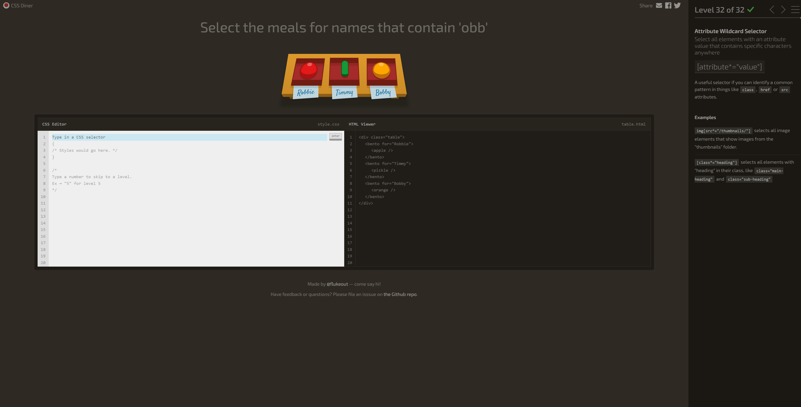

# Selector de tipo (Type Selector):
Descripción: Selecciona elementos basados en su tipo o etiqueta HTML.
Ejemplo de código: p selecciona todos los párrafos en la página.
Aplicación práctica: Útil para aplicar estilos generales a todos los elementos del mismo tipo (por ejemplo, todos los párrafos).
# Selector de clase (Class Selector):
Descripción: Selecciona elementos basados en su atributo class.
Ejemplo de código: .destacado selecciona todos los elementos con la clase “destacado”.
Aplicación práctica: Útil para aplicar estilos específicos a grupos de elementos relacionados.

# Selector de ID (ID Selector):
Descripción: Selecciona un elemento específico basado en su atributo id.
Ejemplo de código: #encabezado selecciona el elemento con el ID “encabezado”.
Aplicación práctica: Útil para aplicar estilos o funcionalidades específicas a un elemento único.
# Selector descendiente (Descendant Selector):
Descripción: Selecciona elementos secundarios dentro de un elemento principal.
Ejemplo de código: ul li selecciona todos los elementos li dentro de una lista desordenada (ul).
Aplicación práctica: Útil para aplicar estilos a elementos anidados.
# Selector de atributo (Attribute Selector):
Descripción: Selecciona elementos basados en sus atributos.
Ejemplo de código: [type="text"] selecciona todos los elementos con el atributo type igual a “text”.
Aplicación práctica: Útil para estilizar elementos específicos según sus atributos.

# Selector de pseudo-clase (Pseudo-class Selector):
Descripción: Selecciona elementos en un estado específico (por ejemplo, :hover para cuando el cursor está sobre el elemento).
Ejemplo de código: a:hover selecciona enlaces cuando el cursor está sobre ellos.
